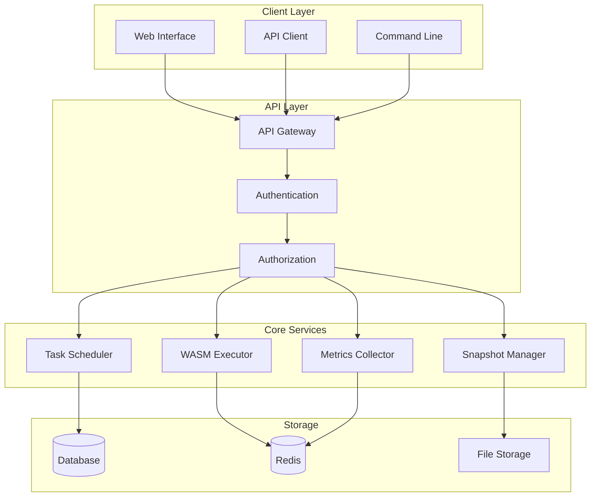
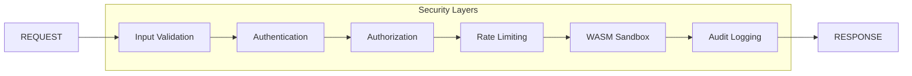

# WASM-as-OS Documentation

Welcome to the comprehensive documentation for WASM-as-OS - a WebAssembly execution platform with operating system-like capabilities.

## 📚 Documentation Structure

### 🚀 [Quick Start Guide](user/quick-start.md)
Get up and running in 5 minutes with our step-by-step quick start guide.

### 📖 User Documentation
- **[Quick Start Guide](user/quick-start.md)** - Get started in 5 minutes
- **[Feature Tutorials](user/tutorials.md)** - Comprehensive tutorials for all features
- **[Troubleshooting Guide](user/troubleshooting.md)** - Common issues and solutions

### 🔧 Technical Documentation  
- **[Architecture Overview](technical/architecture.md)** - System design and components
- **[API Reference](technical/api-reference.md)** - Complete REST API documentation
- **[Deployment Guide](technical/deployment.md)** - Production deployment instructions

### 👨‍💻 Developer Documentation
- **[Contributing Guidelines](developer/contributing.md)** - How to contribute to the project
- **[Code Style Guide](developer/code-style.md)** - Coding standards and best practices
- **[Extension Development](developer/extensions.md)** - Building custom extensions

### 🛡️ Administration Guide
- **[Security Configuration](admin/security-config.md)** - Security setup and hardening
- **[Performance Tuning](admin/performance-tuning.md)** - Optimization guidelines
- **[Monitoring Setup](admin/monitoring.md)** - Monitoring and alerting configuration

### ❓ [Frequently Asked Questions](FAQ.md)
Common questions and answers about WASM-as-OS.

## 🎯 Popular Topics

### For New Users
1. [Installation & Setup](user/quick-start.md#installation)
2. [Your First WASM Module](user/quick-start.md#upload-your-first-module)
3. [Understanding Schedulers](user/tutorials.md#tutorial-4-custom-scheduler-implementation)
4. [Security Best Practices](user/quick-start.md#security-best-practices)

### For Developers
1. [Development Environment Setup](developer/contributing.md#development-environment-setup)
2. [Building WASM Modules](user/tutorials.md#tutorial-1-building-a-math-calculator-module)
3. [API Integration](technical/api-reference.md)
4. [Testing Guidelines](developer/contributing.md#testing-guidelines)

### For Administrators
1. [Production Deployment](technical/deployment.md#production-deployment)
2. [Security Hardening](admin/security-config.md)
3. [Performance Monitoring](admin/monitoring.md)
4. [Backup & Recovery](admin/security-config.md#backup-and-recovery)

## 🔍 Search Documentation

Use the search functionality to quickly find what you're looking for:

```bash
# Search documentation locally
grep -r "scheduler" docs/
grep -r "authentication" docs/
grep -r "performance" docs/
```

## 📱 Interactive Examples

### Try WASM-as-OS Online
- **[Live Demo](https://demo.wasm-as-os.com)** - Try without installation
- **[Interactive Tutorial](https://tutorial.wasm-as-os.com)** - Guided learning experience
- **[Code Playground](https://playground.wasm-as-os.com)** - Test WASM modules online

### Sample Projects
- **[Calculator Module](examples/calculator/)** - Basic arithmetic operations
- **[Image Processor](examples/image-processor/)** - Image manipulation pipeline
- **[Data Analytics](examples/analytics/)** - Real-time data processing
- **[Game Engine](examples/game-engine/)** - Simple game loop implementation

## 🎥 Video Tutorials

### Getting Started Series
1. **[Installation & Setup](https://youtube.com/watch?v=abc123)** (5 min)
2. **[Your First Module](https://youtube.com/watch?v=def456)** (10 min)
3. **[Scheduling Tasks](https://youtube.com/watch?v=ghi789)** (8 min)
4. **[Monitoring & Metrics](https://youtube.com/watch?v=jkl012)** (12 min)

### Advanced Topics
1. **[Custom Schedulers](https://youtube.com/watch?v=mno345)** (15 min)
2. **[Security Configuration](https://youtube.com/watch?v=pqr678)** (20 min)
3. **[Performance Optimization](https://youtube.com/watch?v=stu901)** (18 min)
4. **[Production Deployment](https://youtube.com/watch?v=vwx234)** (25 min)

## 📊 Architecture Diagrams

### System Overview


### Security Architecture


## 🛠️ Tools & Utilities

### Command Line Tools
```bash
# WASM-as-OS CLI
./wasm-as-os --help

# Module management
./wasm-as-os modules list
./wasm-as-os modules upload my-module.wasm
./wasm-as-os modules execute my-module main

# User management
./wasm-as-os admin create-user --username dev1 --roles developer
./wasm-as-os admin list-users

# System monitoring
./wasm-as-os metrics show
./wasm-as-os health check
```

### Development Tools
```bash
# WASM validation
wasm-validate module.wasm

# WASM optimization
wasm-opt -O3 module.wasm -o optimized.wasm

# Static analysis
./wasm-as-os analyze module.wasm

# Performance profiling
./wasm-as-os profile module.wasm function_name
```

## 📋 Cheat Sheets

### [API Quick Reference](technical/api-cheat-sheet.md)
Common API endpoints and examples for quick reference.

### [Configuration Reference](admin/config-reference.md)
All configuration options with descriptions and examples.

### [Troubleshooting Checklist](user/troubleshooting-checklist.md)
Step-by-step troubleshooting for common issues.

## 🌐 Community Resources

### Official Channels
- **Website**: [wasm-as-os.com](https://wasm-as-os.com)
- **GitHub**: [github.com/company/wasm-as-os](https://github.com/company/wasm-as-os)
- **Documentation**: [docs.wasm-as-os.com](https://docs.wasm-as-os.com)
- **Blog**: [blog.wasm-as-os.com](https://blog.wasm-as-os.com)

### Community
- **Forum**: [forum.wasm-as-os.com](https://forum.wasm-as-os.com)
- **Discord**: [discord.gg/wasm-as-os](https://discord.gg/wasm-as-os)
- **Reddit**: [r/wasmAsOS](https://reddit.com/r/wasmAsOS)
- **Stack Overflow**: Tag `wasm-as-os`

### Social Media
- **Twitter**: [@wasmAsOS](https://twitter.com/wasmAsOS)
- **LinkedIn**: [WASM-as-OS](https://linkedin.com/company/wasm-as-os)
- **YouTube**: [WASM-as-OS Channel](https://youtube.com/c/wasmAsOS)

## 📝 Contributing to Documentation

We welcome contributions to improve our documentation!

### How to Contribute
1. **Fork** the repository
2. **Edit** documentation files (Markdown format)
3. **Test** your changes locally
4. **Submit** a pull request

### Documentation Standards
- Use clear, concise language
- Include code examples where applicable
- Add diagrams for complex concepts
- Test all code examples
- Follow our [style guide](developer/docs-style-guide.md)

### Local Development
```bash
# Clone repository
git clone https://github.com/company/wasm-as-os.git
cd wasm-as-os

# Install documentation tools
npm install -g @mermaid-js/mermaid-cli
pip install mkdocs mkdocs-material

# Serve documentation locally
mkdocs serve

# Build documentation
mkdocs build
```

## 📞 Support

### Community Support (Free)
- **GitHub Issues**: Bug reports and feature requests
- **Community Forum**: Questions and discussions
- **Discord**: Real-time community help

### Professional Support
- **Enterprise Support**: 24/7 support with SLA
- **Consulting Services**: Custom development and integration
- **Training Programs**: On-site and remote training

Contact: support@wasm-as-os.com

## 📄 License

This documentation is licensed under [Creative Commons Attribution 4.0 International License](https://creativecommons.org/licenses/by/4.0/).

The WASM-as-OS software is licensed under [Apache License 2.0](https://github.com/company/wasm-as-os/blob/main/LICENSE).

---

**Last Updated**: January 2024  
**Version**: 1.2.0  
**Contributors**: [See CONTRIBUTORS.md](https://github.com/company/wasm-as-os/blob/main/CONTRIBUTORS.md)