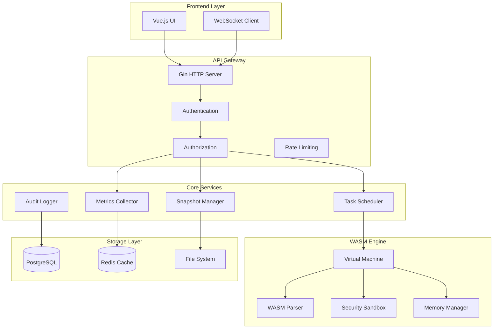
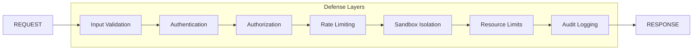

# WASM-as-OS Architecture Overview

## System Architecture

## Component Overview

### Frontend Layer
- **Vue.js UI**: Reactive web interface with real-time updates
- **WebSocket Client**: Live metrics and status updates

### API Gateway
- **Gin HTTP Server**: RESTful API with middleware pipeline
- **Authentication**: JWT-based with multiple providers (OAuth, LDAP, local)
- **Authorization**: Role-based access control (RBAC)
- **Rate Limiting**: Request throttling and DDoS protection

### Core Services
- **Task Scheduler**: Multi-algorithm scheduling (round-robin, priority, cooperative)
- **Metrics Collector**: Real-time performance monitoring with atomic operations
- **Snapshot Manager**: State serialization for reproducible testing
- **Audit Logger**: Comprehensive security and operational logging

### WASM Engine (Rust)
- **WASM Parser**: Binary format validation and parsing
- **Virtual Machine**: Execution environment with resource limits
- **Security Sandbox**: Capability-based isolation
- **Memory Manager**: Linear memory with bounds checking

### Storage Layer
- **PostgreSQL**: Persistent data storage
- **Redis**: Caching and session management
- **File System**: Module storage and snapshots

## Security Architecture

## Data Flow

### Module Execution Flow
1. **Upload**: Client uploads WASM module via REST API
2. **Validation**: Static analysis and security scanning
3. **Storage**: Module stored with metadata in database
4. **Scheduling**: Task created and queued by scheduler
5. **Execution**: WASM VM executes in sandboxed environment
6. **Monitoring**: Metrics collected and streamed to clients
7. **Cleanup**: Resources released and results stored

### Real-time Metrics Flow
1. **Collection**: Atomic counters updated during execution
2. **Aggregation**: Time-series data buffered in circular buffers
3. **Streaming**: WebSocket broadcasts to connected clients
4. **Storage**: Historical data persisted to Redis
5. **Alerting**: Threshold violations trigger notifications

## Performance Characteristics

| Component | Throughput | Latency | Memory |
|-----------|------------|---------|---------|
| API Gateway | 10K req/sec | <10ms | 50MB |
| WASM Engine | 1K exec/sec | <100ms | 100MB |
| Metrics | 100K ops/sec | <1ms | 200MB |
| Scheduler | 5K tasks/sec | <5ms | 20MB |

## Scalability Design

- **Horizontal Scaling**: Stateless API servers behind load balancer
- **Vertical Scaling**: Resource limits configurable per module
- **Caching Strategy**: Multi-level caching (Redis, in-memory)
- **Database Optimization**: Connection pooling and query optimization